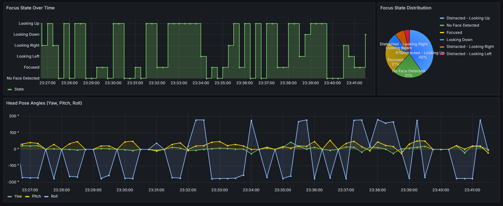

# 🚀 AI Focus & Attention Tracker


A real-time monitoring system that uses computer vision to analyze your focus and attention during work or study sessions. This tool provides actionable insights into your work patterns, helping you understand when you're most productive and when you're prone to distraction.

## ✨ The Dashboard in Action

The system culminates in a comprehensive Grafana dashboard that visualizes your focus data in real-time, providing both a live snapshot and historical trends of your attention levels.



## 🌟 Key Features

* **Real-time Head Pose Estimation:** Utilizes OpenCV and MediaPipe to accurately track the yaw, pitch, and roll of your head from a webcam feed.
* **Multi-State Focus Classification:** Intelligently classifies your state into categories such as "Focused," "Looking Down," "Distracted - Looking Left/Right," and more.
* **Live Monitoring with Prometheus:** All metrics are exposed to a Prometheus time-series database for robust data collection.
* **Interactive Grafana Dashboard:** A rich, pre-configured Grafana dashboard visualizes your focus state, time distribution, and raw head pose angles.
* **Containerized & Reproducible:** The entire application stack (Frontend, FastAPI, Prometheus, Grafana) is containerized with Docker for a simple, one-command setup.

## 🛠️ Tech Stack

* **Frontend:** HTML, CSS, JavaScript
* **Backend Application:** Python, FastAPI
* **Computer Vision:** OpenCV, MediaPipe
* **Orchestration:** Docker, Docker Compose
* **Metrics & Monitoring:** Prometheus, Grafana

## ⚙️ How It Works

The data flows through a simple yet powerful pipeline:

`[Browser Frontend] ➡️ [FastAPI WebSocket] ➡️ [Python CV Logic] ➡️ [Prometheus Metrics] ➡️ [Grafana Dashboard]`

1.  The **Frontend** application captures video frames from your webcam and streams them over a WebSocket.
2.  The **FastAPI backend** receives each frame and processes it with MediaPipe to determine head pose.
3.  The angles are analyzed to classify the current **focus state**.
4.  Key metrics are updated and exposed on a `/metrics` endpoint.
5.  **Prometheus** scrapes this endpoint periodically to collect the data.
6.  **Grafana** queries Prometheus to populate the live dashboard.

## 🚀 Getting Started

Getting the tracker up and running on your local machine is simple.

### Prerequisites

* [Docker](https://www.docker.com/get-started)
* [Docker Compose](https://docs.docker.com/compose/install/)

### Installation

1.  **Clone the repository:**
    ```bash
    git clone [https://github.com/your-username/your-repo-name.git](https://github.com/your-username/your-repo-name.git)
    cd your-repo-name
    ```

2.  **Run the application stack:**
    ```bash
    docker-compose up --build -d
    ```
    This command will build the necessary images and start all services in the background.

## 💻 Usage

Once the services are running, you can access the different components of the system:

1.  **Open the Web Application:**
    * Navigate to the frontend URL in your browser (e.g., `http://localhost:8080`). Check your `docker-compose.yml` for the exact port. This will start the webcam feed.

2.  **View your Grafana Dashboard:**
    * URL: `http://localhost:3000`
    * Login: `admin` / `admin`

3.  **Explore Prometheus:**
    * URL: `http://localhost:9090`
    * You can run queries directly here (e.g., `focus_state`).

4.  **Access the API Docs:**
    * URL: `http://localhost:8000/docs`

## 🔮 Future Development & Roadmap

This project has a strong foundation for many exciting new features, including:

* **Continuous "Focus Score":** Implement a 0-100 score for a more nuanced view of attention.
* **Blink & Drowsiness Detection:** Use eye aspect ratio (EAR) to track blink rate and detect signs of fatigue.
* **Session Tracking:** Add functionality to start/stop "work sessions" to compare focus across different tasks.
* **Grafana Alerting:** Configure alerts to get notified after a prolonged period of distraction.

## 📄 License

This project is licensed under the MIT License. See the `LICENSE` file for details.
